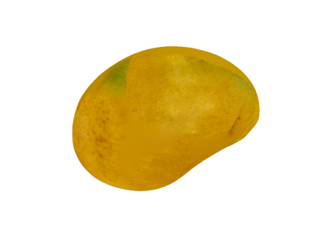
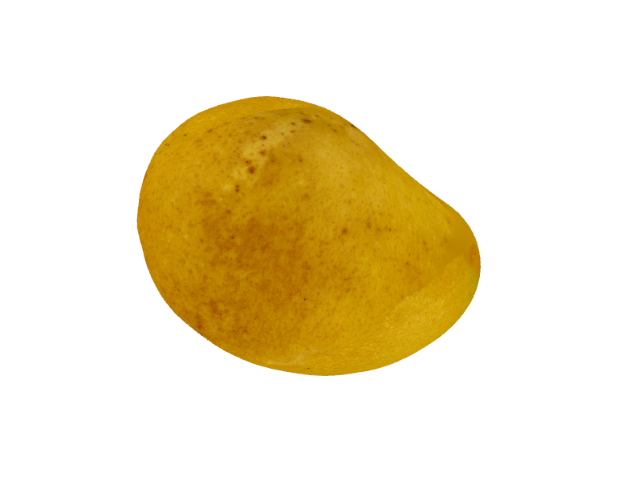

# Research of 2D Image-Based 3D View Generation

In this research, we explore the concept of generating 3D views from 2D images. 

Load a 3D model into a window and capture both the original scene and a scene rotated by 30 degrees.
This can be used as ground truth data for image generation model.

## Original Image

*Description: This is the original scene captured from the 3D model.*

## 30-Degree Rotation Image

*Description: This is the same scene after a 30-degree rotation.*